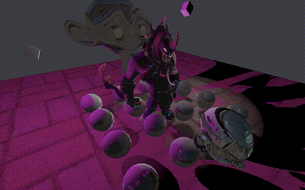

# Mjolnir Engine

Mjolnir is a minimalistic rendering engine. The goal is to create a simple set of tools to help people quickly create fast graphical applications

# Work in Progress

- Scene Manager
- GLTF asset loader
- PBR Material
- Post-process Effect
- Particle System

# Disclaimer

This is a project under active development. It is not yet stable, may contain bugs or incomplete features
