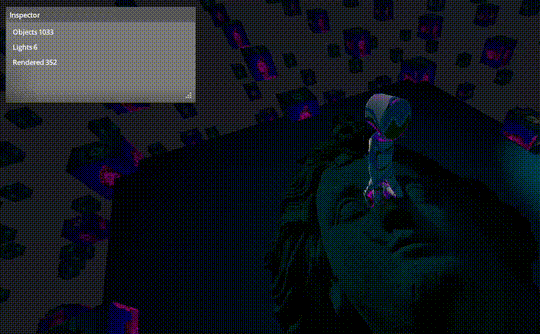

# Mjolnir Engine

Mjolnir is a minimalistic rendering engine. The goal is to create a simple set of tools to help people quickly create fast graphical applications

# Work in progress

This is a work in progress. Functions are supposed to break frequently.
