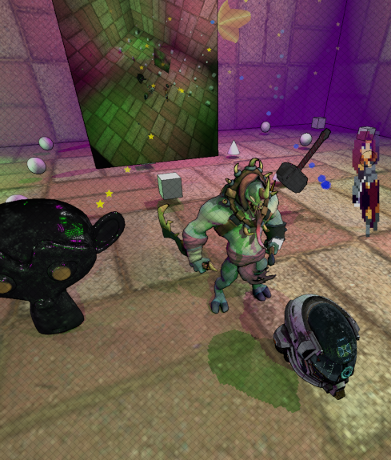

# Mjolnir Engine

Mjolnir is a minimalistic rendering engine. Implementation will sometimes prefer simplicity over comprehensive functionality. The goal is to create a simple set of tools to help people quickly create fast graphical applications

[](https://github.com/hucancode/mjolnir/actions/workflows/logic-test.yml)
[](https://github.com/hucancode/mjolnir/actions/workflows/visual-test.yml)



# Build scripts
```sh
make build # build the project in release mode without running
make run # build and run the project in release mode
make debug # build and run the project in debug mode
make test # run the tests
make clean # clean the build artifacts
make check # check for compiler errors without building
make shader # build all shaders
```

# Disclaimer

This is a project under active development ([roadmap](https://notes.hucanco.de/mjolnir)). It is not yet stable, may contain bugs or incomplete features
