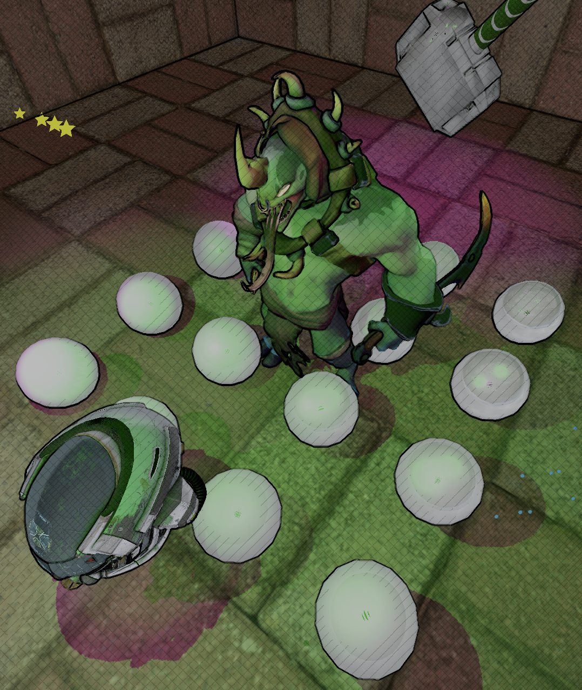

# Mjolnir Engine

Mjolnir is a minimalistic rendering engine. The goal is to create a simple set of tools to help people quickly create fast graphical applications

# Work in Progress

- Culling
- Defered Rendering

## To do

- Multi thread rendering

# Disclaimer

This is a project under active development. It is not yet stable, may contain bugs or incomplete features

# Implementation notes
## Deferred Shading
For simplicity, assume all objects use lit material
- Depth Pre-pass, output the following fullscreen quad
  - Depth, D32
  - No fragment shader
- Shadow Pass, output the following textures
  - Shadow Maps, D32
  - Shadow map count equal to `n * 6 + m`, where n is point lights count and m is other lights count
  - Draw calls count in this pass equal to `n*k` where n is the number of shadow maps and k is average number of objects per shadow maps
- G Buffer Pass, output the following fullscreen quads
  - Position, R32G32B32A32
  - Normal, R8G8B8A8
  - Albedo, R8G8B8A8
  - Metallic Roughness, R8G8B8A8
  - Emissive, R8G8B8A8
  - Draw calls count in this pass equal to the number of objects (after frustum culled)
- PBR Lighting Pass, take all inputs from G Buffer Pass, Shadow Pass, output 1 texture
  - Final Color, R8G8B8A8
  - For point light, draw a sphere, sphere size is the light radius
  - For directional light, just draw the whole screen (1 quad)
  - For spot light, draw a cone that match spot light's shape
  - Avoid draw fullscreen quad since light may not affect the whole screen
  - Use light information via push constant and render final lit image for 1 light at a time
  - Draw calls count in this pass equal to the number of lights
  - Eventually the final image will be filled with lit pixels
- Transparent Pass
  - Draw all transparent objects to final color texture additively, use depth test
  - For simplicity, assume transparent objects are not affected by lights
- Particle Pass
  - Render particles to final color texture, use depth test
  - For simplicity, assume particles are not affected by or emit light
- Post-Process Passes
  - Take final color image, depth, normal
  - Do the post process as usual