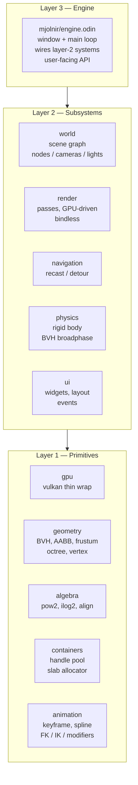
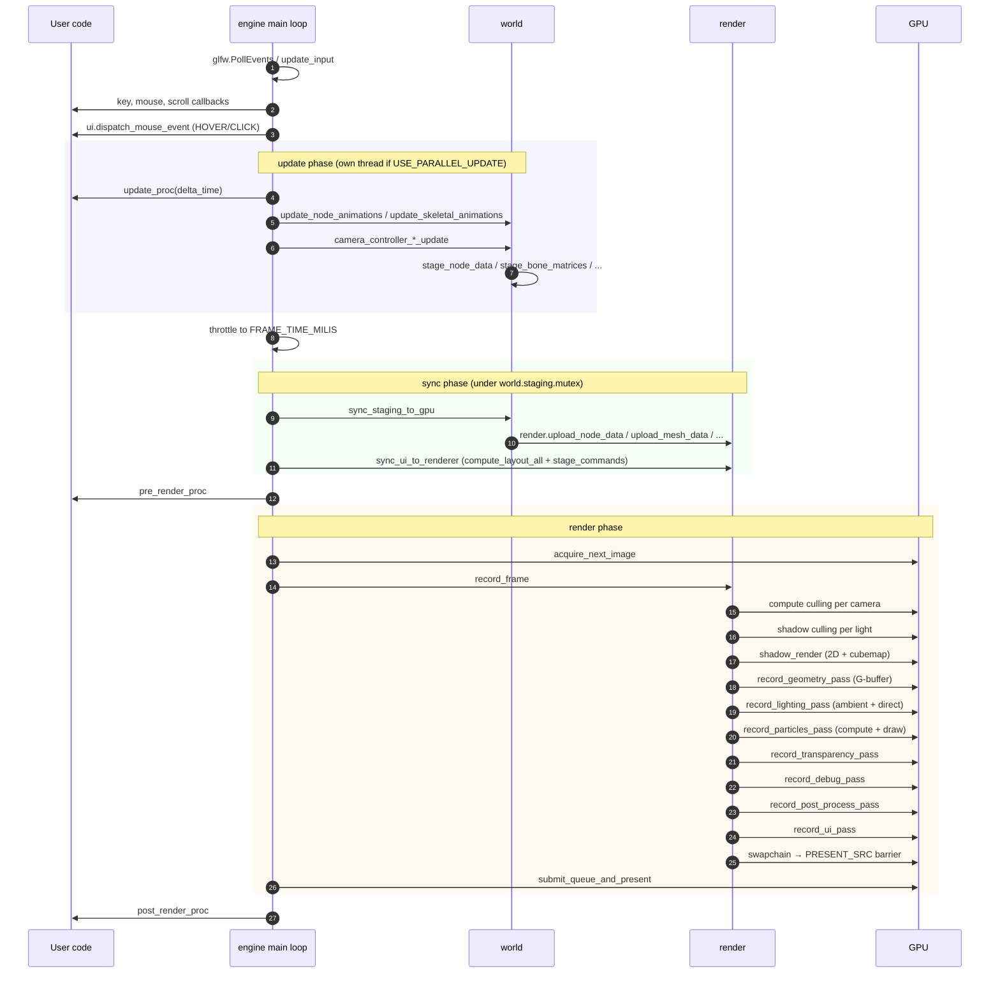
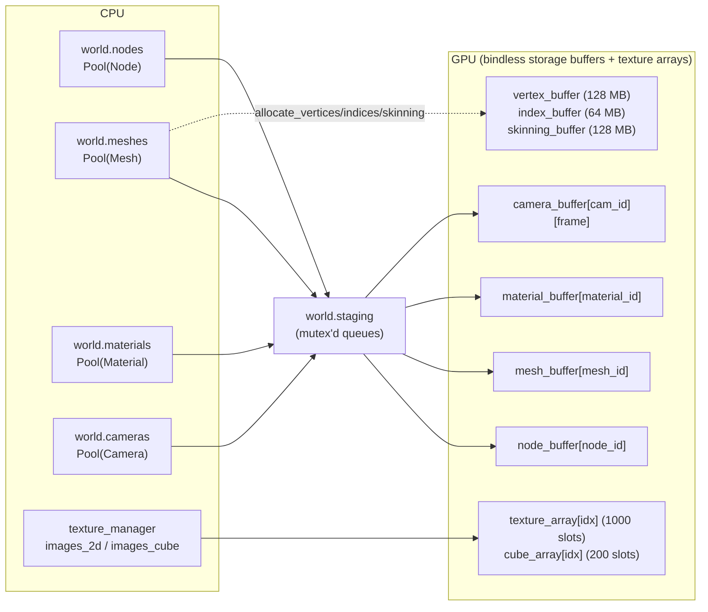
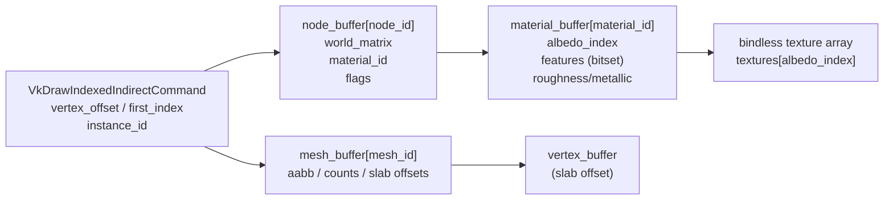
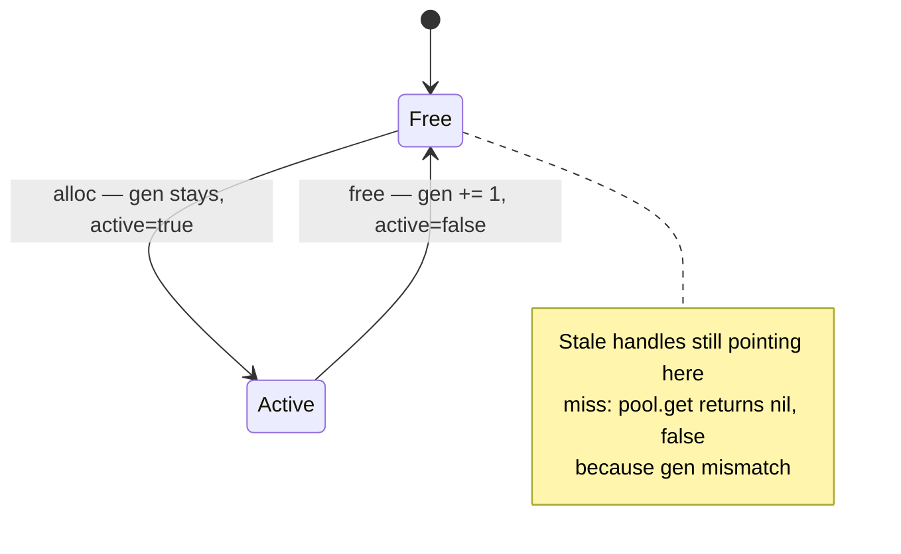
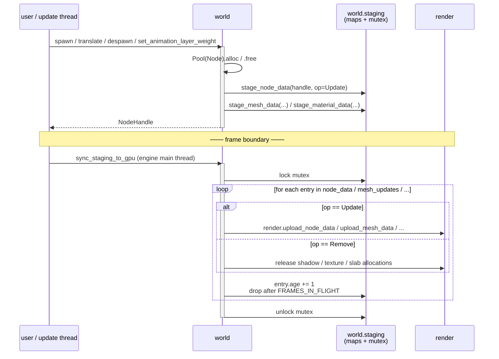
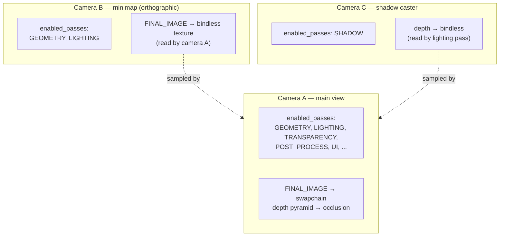
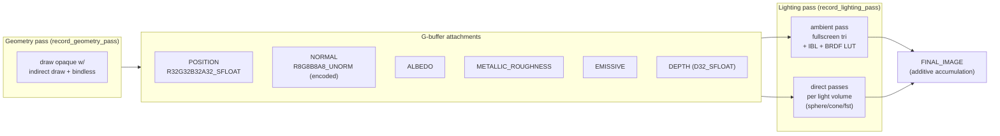
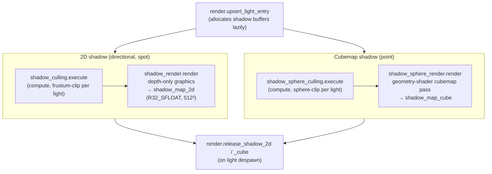
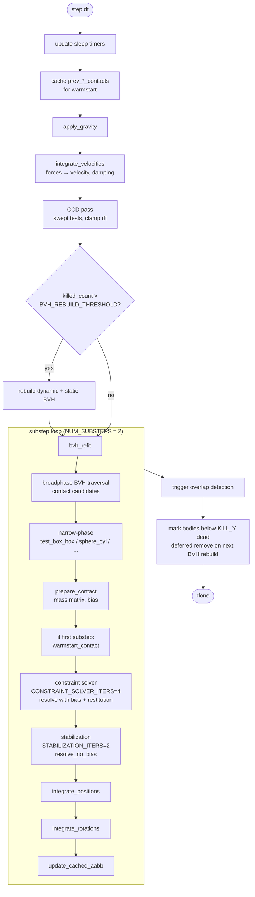

# Architecture

Mjolnir is a deferred-shading, bindless, GPU-driven game engine in Odin + Vulkan 1.3.
This page explains *why* the engine is shaped the way it is. Each design decision
maps back to one of the rules in [`ZEN.md`](../ZEN.md):

> 1. Single source of truth — avoid storing derived information unless evidence of perf issue
> 2. No duplicated information across structs, no pointer fields on structs
> 3. Keep struct definition count minimum
> 4. Modules organized in layers, dependency goes top → bottom
> 5. Avoid indirection / wrapper when possible
> 6. Do not leak internal detail to user

---

## 1. Layered module organization

The codebase is split into three strict layers. **Higher layer depends on lower
layer; never the reverse, never sideways.** A module on layer N must compile
without any module on layer N or N+1.



---

## 2. Frame timeline



### Update vs render decoupling

- `RENDER_FPS` (default 60) governs `record_frame` cadence.
- `UPDATE_FPS` (default = `RENDER_FPS`) governs `update`.
- `USE_PARALLEL_UPDATE=true` moves `update` to a dedicated thread. Render
  thread keeps its own cadence; sync happens through `world.staging` (mutexed).

---

## 3. Bindless GPU resources

Mjolnir is **bindless** end-to-end. There are no per-draw descriptor binds
inside the geometry/lighting/shadow loops. All resources live in giant arrays
indexed by `u32`.



### How a draw call resolves on the GPU



Push constants only carry per-pass info (camera index, light index). Per-object
state lives in storage buffers indexed by ID.

---

## 4. Handles, not pointers
Pointers to dynamic-array-backed pool entries are unstable: the underlying
`[dynamic]Entry(T)` reallocs on grow and the pointer once valid is then corrupted.
That encourage us to use handle-based object referencing.
Layer 1 (`containers/handle_pool.odin`) defines:

```odin
Handle :: struct {
  index:      u32,
  generation: u32,
}

Pool($T) :: struct {
  entries:      [dynamic]Entry(T),
  free_indices: [dynamic]u32,
}
```

Every long-lived object (Node, Mesh, Material, Camera, Light, Sprite, Emitter,
ForceField, Clip, Texture2D, TextureCube, RigidBody, Trigger, Widget) is owned
by a `Pool` and referenced by a `distinct` handle.

### Generational counter



- Slot starts with `generation = 1`.
- Free → `generation += 1` (wraps but never lands on 0).
- `pool.get(handle)` returns `nil, false` if `entries[handle.index].generation != handle.generation`.

So:
- A handle held after free returns a clean miss (no UAF, no stale memory).
- You can serialize / load handles without rewiring pointers.

---

## 5. The staging pipeline (CPU mutation → GPU upload)

`world` module must not touch GPU buffers. Instead it
**stages** a change, and `sync_staging_to_gpu` drains the staging maps once
per frame on the render thread.



Some design notes:

- **Frames in flight (default 2).** A `Remove` cannot happen the same frame —
  the GPU may still be reading the resource for frame `N-1`. Staging entries
  carry an `age: u16`; only after `age >= FRAMES_IN_FLIGHT` do we actually
  release the GPU side.
- **Single source of truth** CPU state in `world` is authoritative.
  GPU mirrors are derived. Drift is impossible because drift requires *two
  writers*, and `render` only ever reads from staging.
- **Threading.** `update` thread mutates `world` + queues staging entries
  under the staging mutex. The render thread acquires the same mutex once per
  frame in `sync_staging_to_gpu` and drains.

---

## 6. Camera

Each `world.Camera` carries a `PassTypeSet` describing which passes to run for
it. The render layer keeps a `CameraTarget` per camera, with **per-frame**
`[FRAMES_IN_FLIGHT]Texture2DHandle` for every `AttachmentType` (POSITION,
NORMAL, ALBEDO, METALLIC_ROUGHNESS, EMISSIVE, FINAL_IMAGE, DEPTH) plus its own
depth pyramid for occlusion culling.



`get_camera_attachment(engine, cam_handle, .FINAL_IMAGE)` returns the texture
handle, which is just a bindless index. Compositing camera-B-into-camera-A
costs nothing extra at the API level — Camera A's UI quad samples the returned
handle.

---

## 7. Deferred shading + light volumes



A light volume (sphere for point light, cone for spot light, fullscreen triangle for
directional light) is rasterized with depth-test reversed; only fragments inside the
light's reach are shaded. Avoids the "shade every pixel against every light"
loop without needing a tile / cluster yet (see §11).

---

## 8. Shadow strategy



Each shadow-casting light gets its own pair of buffers
(`MutableBuffer(vk.DrawIndexedIndirectCommand)` + count).
`INVALID_SHADOW_INDEX = 0xFFFFFFFF` flags lights that shouldn't cast.

Cubemap shadows need `REQUIRE_GEOMETRY_SHADER=true` at build time (one draw,
six layers via geometry shader).

---

## 9. Physics



---

## 10. Where to go next

| If you want to...                          | Read                                           |
| ------------------------------------------ | ---------------------------------------------- |
| Build something step by step               | [`cookbook.md`](cookbook.html)                 |
| Understand the public engine API           | [`api_engine.md`](api_engine.html)             |
| Understand scene graph + handles in detail | [`api_world.md`](api_world.html)               |
