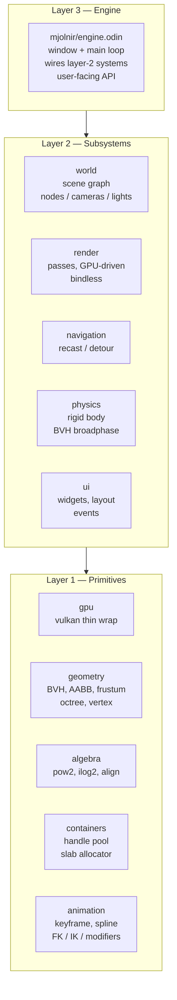

Mjolnir is a deferred-shading, bindless, GPU-driven game engine in
Odin + Vulkan 1.3. This page is about *why* the engine is shaped the
way it is, not what the code does.

## Guiding rules

1. **Single source of truth.** Don't store derived state unless
   profiling demands it.
2. **No duplicated data across structs.** No pointer fields on
   structs — handles only.
3. **Keep struct definition count to a minimum.**
4. **Modules in layers.** Dependency goes top → bottom only.
5. **Avoid indirection / wrappers** when the underlying call already
   reads well.
6. **Do not leak internal detail to user code.**

---

## Layered modules

The codebase splits into three layers. **Higher layer depends on
lower; never the reverse, never sideways.** A module on layer N must
compile without any module on layer N or N+1.



---

## Frame phases

```
poll input → update → throttle → sync → pre_render → render → present → post_render
```

- **Update** runs at `UPDATE_FPS` (defaults to `RENDER_FPS`). On its
  own thread if `USE_PARALLEL_UPDATE=true`.
- **Sync** drains the staging queue into GPU buffers under the
  staging mutex. Always on the render thread.
- **Render** records the full pipeline (cull → shadow → geometry →
  lighting → particles → transparency → debug → post-process → UI)
  via dynamic rendering, then submits.

Update and render are decoupled. Sync is the only contact point.

---

## The staging contract

`world` mutates CPU state but never touches GPU buffers. Every
mutation appends to a private staging queue. `sync_staging_to_gpu`
drains the queue once per frame on the render thread and forwards
entries to `render`.

Two consequences:

- **No drift.** CPU is authoritative; GPU is a mirror. Drift would
  require two writers, and `render` only ever reads.
- **Releases are deferred by `FRAMES_IN_FLIGHT`.** Each staging entry
  carries an `age`. A `Remove` doesn't free the GPU side until the
  GPU is past the frame that might still be reading it. Avoids
  use-after-free without an explicit fence chain on every resource.

---

## Cameras as first-class render targets

Each `Camera` carries a `PassTypeSet` (which passes apply) plus
per-frame attachments for every G-buffer slot. The main view is just
a camera with the full pass set; a minimap is a camera with
`{GEOMETRY, LIGHTING}`; a shadow caster is a camera with `{SHADOW}`.

`get_camera_attachment(cam, .FINAL_IMAGE)` returns a bindless texture
handle. Compositing camera B's output into camera A's material or UI
quad costs nothing extra at the API level — it's just another
bindless index.

---

## Deferred shading + light volumes

Forward shading scales as `pixels × lights`. The G-buffer is filled
once; ambient + IBL run as a single fullscreen pass; each direct
light rasterizes its volume (sphere / cone / fullscreen triangle)
with reversed depth so only fragments it can reach get shaded.
Avoids the per-pixel-per-light loop without needing tile or cluster
infrastructure.

---

## Shadows

- **2D maps** for directional + spot. Compute pass clips against the
  light frustum; depth-only graphics pass writes a 512² slice.
- **Cubemap** for point lights. Geometry-shader-amplified single
  draw renders all six faces (`-define:REQUIRE_GEOMETRY_SHADER=true`
  required at build).

Shadow buffers are allocated lazily per light on first cast, freed on
despawn.

---

## Physics step

```
sleep timers → warmstart cache → gravity → integrate velocity
            → CCD pass (clamp dt for fast bodies)
            → BVH rebuild (only if kill-count above threshold)

substep × NUM_SUBSTEPS:
  refit → broadphase → narrow-phase → prepare contact
  → warmstart (first substep) → solver iters → stabilization iters
  → integrate position + rotation → cached AABB

trigger overlap → defer-kill bodies below KILL_Y
```

Key choices: BVH (not grid) broadphase, refit-most-frames /
rebuild-when-dirty, warmstart from previous frame, Baumgarte bias
with a separate bias-free stabilization pass, deferred kills to keep
handle generations stable inside a step.

---

## Where to go next

- [`engine`](engine.html), [`world`](world.html),
  [`render`](render.html), [`physics`](physics.html),
  [`navigation`](navigation.html), [`ui`](ui.html),
  [`animation`](animation.html) — module intros.
- [`examples`](examples.html) — runnable examples and notes.
