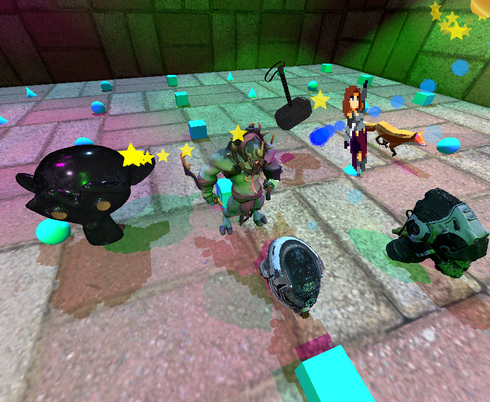

# Mjolnir Engine

[Mjolnir](https://github.com/hucancode/mjolnir) is a minimalistic game engine to help people enjoy game programming



# Get Started
To use Mjolnir in your odin code, run `make shader` to compile shaders to SPIR-V and then copy `mjolnir` directory to your project and start using mjolnir API.
See `examples` for common use cases.

# Notable features

- Physically-Based Rendering
- Camera, Light, Shadow
- Skinning, Animation
- GLTF
- Post-processing
- Billboard, Sprite
- Tween, Spline
- Particles Simulation
- Render to texture
- Physics
- Recast/Detour
- Inverse Kinematics
- HUD, text

And more in development

- Procedural Animation (Tail, Leg)
- Animation Layering

## Build Commands

```bash
# Build and run in release mode
make run
# Build and run in debug mode and vulkan validation
make debug
# Build only (release mode)
make build
# Build only (debug mode)
make build-debug
# Build all shaders
make shader
# Run all tests
odin test . --all-packages
# run a single test called "test_name" inside "module_name"
odin test . --all-packages -define:ODIN_TEST_NAMES=module_name.test_name
```

## Architecture Overview

### Core Engine Structure
The engine is organized 3 layers with clear responsibility boundaries.
Systems on the same level must not depends on each other directly or indirectly. For example *Render* module and *World* module must be able to independently developed by 2 different teams without much communication. 

**Lower Level Systems:**

- **GPU**: `mjolnir/gpu/` - Vulkan context, memory/texture/mesh management, swapchain, pipeline helpers
- **Containers**: `mjolnir/containers/` - Generic data structures (handle pools, slab allocators)
- **Geometry**: `mjolnir/geometry/` - Camera, transforms, primitives, BVH, octree, AABB, frustum
- **Animation**: `mjolnir/animation/` - Skeletal animation support

**Higher Level Systems:**

- **Render**: `mjolnir/render/` - Consists of render sub-systems
  + Geometry Renderer
  + Lighting/Shadow Renderer
  + Transparency Renderer
  + Particle Renderer
  + Post-process Renderer
  + Camera/Visibility Culling
  + UI Renderer
- **World**: `mjolnir/world/` - Scene graph, GLTF/OBJ loading
- **Physics**: `mjolnir/physics/` - Rigid body dynamics, collision detection
- **Navigation**: `mjolnir/navigation/` - Recast + Detour

**Engine System:**

- **Engine**: `mjolnir/engine.odin` - Final integration point, user-facing API

For more information, see [usage (WIP)](usage.html)

## Development Notes


### GPU Resource Management
- Uses custom slab allocators to sub-allocate vertices/indices/bone matrices
- **Bindless**: All GPU resources managed in array-based system. Draw commands send resource IDs to index into GPU arrays instead of raw data

### Shader Development
- Shaders are in `mjolnir/shader/` organized by render pass
- Use `make shader` to rebuild all shaders. It's fast and incremental, you need not to build individual shader
- Compute shaders include:
  + Particle system: `compute.comp`, `compact.comp`, `emitter.comp`
  + Culling systems: `culling.comp` for visibility

### Debugging Tips

- To debug visual issues, build with *FRAME_LIMIT* set to something like 10, then check the log
- Collect screenshot with `make capture`
- To slow down the engine to examine render logs, build with *RENDER_FPS* set to low value like 4 or 2

### Build Flags

- **REQUIRE_GEOMETRY_SHADER**: Compile with geometry shader support (required for spherical shadow mapping)
- **USE_PARALLEL_UPDATE**: Enable dedicated update thread for parallel scene updates
- **FRAME_LIMIT**: limit renderer to only render a few frames
- **RENDER_FPS**: limit renderer FPS
- **UPDATE_FPS**: limit logic update FPS
