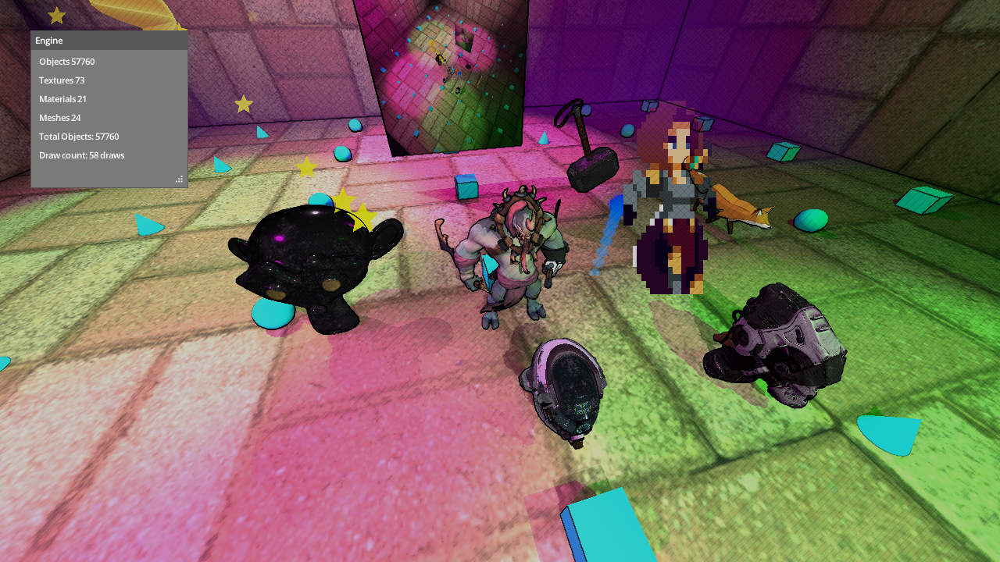

# Mjolnir Engine

[Mjolnir](https://github.com/hucancode/mjolnir) is a minimalistic, bindless,
GPU-driven game engine in Odin + Vulkan 1.3.



## Get started

To use Mjolnir, run `make shader` to compile shaders to SPIR-V and copy the
`mjolnir/` directory into your project. See `examples/` for canonical usage.

## Notable features

- Physically-based rendering (deferred + IBL + light volumes)
- Bindless GPU resources, GPU-driven culling (frustum + Hi-Z occlusion)
- Cameras as render targets (sample any camera's output as a bindless texture)
- 2D and cubemap shadows
- Skeletal animation: keyframes + spline + FK + IK (FABRIK) + procedural modifiers
- Animation layering with bone masks, blend modes, transitions
- glTF and OBJ loading
- Particle simulation + force fields (compute shader)
- Rigid-body physics with CCD, BVH broadphase, SIMD contact solver
- Recast + Detour navigation
- 2D UI: widgets, layout, events, fontstash text
- Post-process stack: tonemap, bloom, blur, fog, outline, DoF, crosshatch

## Build commands

```bash
# Build and run in release mode
make run
# Build and run in debug + Vulkan validation
make debug
# Build only
make build         # release
make build-debug   # debug
# Build all shaders
make shader
# Run all tests
odin test . --all-packages
# Run a single test
odin test . --all-packages -define:ODIN_TEST_NAMES=module_name.test_name
# Run performance benchmarks (writes artifacts/bench*.json)
make bench
```

## Build flags

| Flag | Default | Effect |
|---|---|---|
| `FRAMES_IN_FLIGHT` | 2 | GPU frame buffering. |
| `RENDER_FPS` | 60 | Target render cadence. |
| `UPDATE_FPS` | `RENDER_FPS` | Target update cadence. |
| `USE_PARALLEL_UPDATE` | false | Run `update` on a dedicated thread. |
| `FRAME_LIMIT` | 0 | Cap total frames (0 = unlimited). |
| `REQUIRE_GEOMETRY_SHADER` | false | Required for cubemap point-light shadows. |

## Debugging tips

- For visual issues: build with `-define:FRAME_LIMIT=10`, inspect logs.
- Capture screenshots with `make capture`.
- Slow the renderer with `-define:RENDER_FPS=4` to read render logs frame by frame.
- Toggle `engine.debug_ui_enabled = true` for the microui overlay.


## Read more about engine internals

1. [`architecture.md`](architecture.html) — layered design, frame timeline,
   bindless model, staging pipeline, physics step, shadow strategy. **Read
   this first.** All other docs assume it.
2. [`cookbook.md`](cookbook.html) — task-oriented recipes (cube, glTF,
   physics, animation blending, IK, particles, navmesh, post-process, UI).
3. `api_*.md` — exhaustive per-module reference. One page per module.

## API reference index

| Layer | Module | Reference |
|---|---|---|
| 1 | `gpu`        | [api_gpu.md](api_gpu.html) |
| 1 | `geometry`   | [api_geometry.md](api_geometry.html) |
| 1 | `algebra`    | [api_algebra.md](api_algebra.html) |
| 1 | `containers` | [api_containers.md](api_containers.html) |
| 1 | `animation`  | [api_animation.md](api_animation.html) |
| 2 | `world`      | [api_world.md](api_world.html) |
| 2 | `render`     | [api_render.md](api_render.html) |
| 2 | `physics`    | [api_physics.md](api_physics.html) |
| 2 | `navigation` | [api_navigation.md](api_navigation.html) |
| 2 | `ui`         | [api_ui.md](api_ui.html) |
| 3 | `mjolnir`    | [api_engine.md](api_engine.html) |

## Performance tracking

Performance over time is tracked at
[hucancode.github.io/mjolnir/dev/bench](https://hucancode.github.io/mjolnir/dev/bench).
